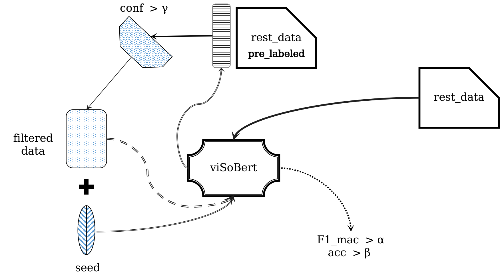
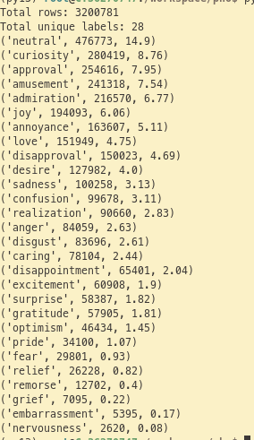

# Annotations (Gán nhãn)

## Quy trình.


## Chuẩn bị tập hạt giống.

- Dữ liệu được lấy ngẫu nhiên 10000 dòng từ tập dữ liệu đã được thu thập và tiền xử lý. Sau đó kết hợp với quy tắc mà thu thập thêm các dòng dữ liệu cho các nhãn hiếm như (`grief`, `nervousness`, `remorse`,...)
- Ví dụ: Một câu có chứa các từ như `chia buồn`, `xót xa`, `mất mát`, `vĩnh biệt` hay `rip` thường có khả năng cao là phù hợp với nhãn `grief`. Hay chứa các từ như `xin lỗi`, `hối hận`, `cắn rứt`... thường có thể là `remose`...

- Sau đó ta cũng bổ sung tập dữ liệu ViGoEmotions từ công trình *ViGoEmotions: A Benchmark Dataset For Fine-grained Emotion Detection on Vietnamese Texts* để sự đa dạng về lượng lẫn chất cho tập seed.

- Và đồng thời vì các nhãn hiếm thường có tỉ lệ (1:30) so với các nhãn đa dạng, cho nên ta cần phải sinh dữ liệu giả từ các mô hình LLM (như Gemini).

## Fine-tuning mô hình ViSoBert gán nhãn.

- Chúng ta sử dụng mô hình ViSoBert (mô hình đã được huấn luyện với ngữ liệu mạng xã hội Việt Nam) để sử dụng cho quá trình gán nhãn.

- Một vòng đời gán nhãn tự động của chúng ta sẽ bắt đầu từ tập seed với một lượng nhỏ mẫu được trích xuất, fine-tuning hết mức có thể (F1 macro lớn nhất có thể).

- Tiếp tục, dùng mô hình đã fine-tuning đó để dữ đoán nhãn (gán nhãn giả) cho toàn bộ tập dữ liệu còn lại và tùy theo trường hợp mà ta lọc ra các dòng dữ liệu để tiếp tục vòng đời tiếp theo.
    - Nếu tập seed của chúng ta có số lượng dưới `100000` hoặc có sự phân bố không đều giữa các nhãn thì ta sẽ cố gắng lấy mỗi nhãn trong tập còn lại với số lượng `K_SAMPLE` mà có xác suất dự đoán cao nhất.
    - Ngược lại nếu tập seed của ta có số lượng lớn, thì ta chỉ cần lấy ra những dòng có xác suất dự đoán lớn hơn 0.85 hoặc 0.9

## Xác thực chính thức.
- Sau khi chúng ta fine-tuning tới một mức chuẩn (F1 macro > 0.9) là dấu hiệu để ta dùng nó gán nhãn cho toàn bộ tập còn lại và dùng nó để huấn luyện các mô hình mới cho tác vụ phân tích cảm xúc cụ thể.
- Với lần xác thực và gom nhãn chính thức. Ta thực hiện đặt ra một giới hạn dưới là 0.6 cho xác suất dự đoán, và đặt các cận dưới cao hơn cho từng nhãn để đảm bảo dữ liệu có nhãn chuẩn xác nhất có thể. Cụ thể như sau.

```
 {
    # MINORITY CLASSES: Optimized for Data Retention
    # Lowering thresholds to ensure sufficient representation of rare labels
    'grief': 0.45, 'nervousness': 0.45, 'embarrassment': 0.50,
    'remorse': 0.55, 'pride': 0.60, 'relief': 0.60,

    # BALANCED CLASSES: Maintaining Precision-Recall Equilibrium
    # Mid-range thresholds for labels with moderate frequency
    'disgust': 0.65, 'confusion': 0.65, 'fear': 0.65, 'disappointment': 0.70,
    'caring': 0.70, 'desire': 0.70, 'optimism': 0.75, 'realization': 0.75,
    'surprise': 0.75, 'excitement': 0.75,

    # MAJORITY CLASSES: Optimized for High Confidence
    # Higher standards to filter the most reliable samples from large pools
    'annoyance': 0.80, 'disapproval': 0.80, 'curiosity': 0.80, 
    'anger': 0.80, 'sadness': 0.80, 'amusement': 0.80,
    'admiration': 0.82, 'joy': 0.82, 'approval': 0.82,

    # DENSITY CONTROL: High-Strictness Filtering
    # Strict thresholds to prevent dataset imbalance and ensure elite quality
    'love': 0.85, 'gratitude': 0.85, 'neutral': 0.88
}
```

## Một số kết quả thực hiện.

### Vòng 2 (`ft_90k`)


### Vòng 3 (`ft_173k`)


### Vòng 4 (`ft_843k`)


### Phân phối tập dữ liệu cuối cùng.

