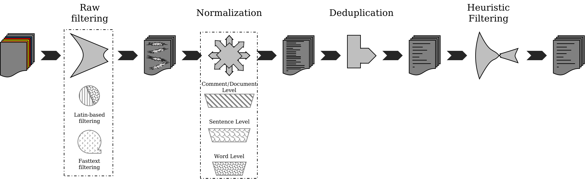
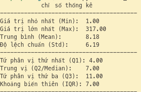
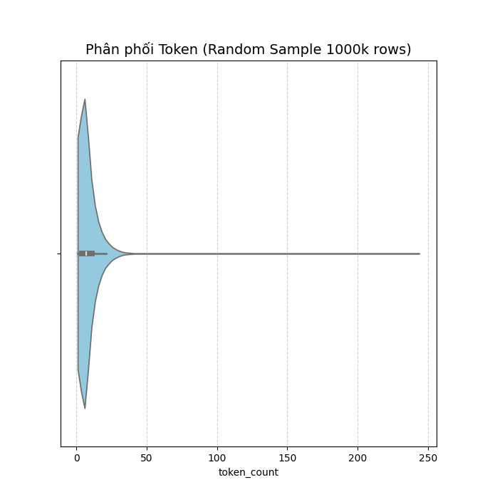
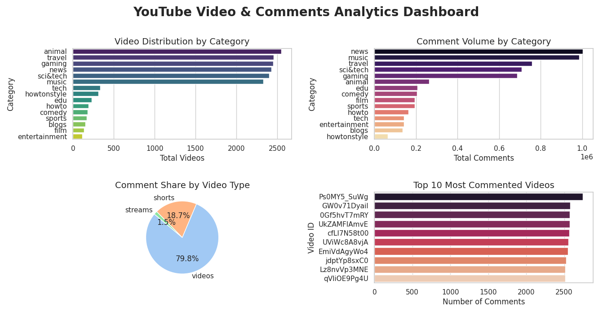

# Preprocessing

Dữ liệu bình luận trên YouTube thường mang đặc điểm của ngôn ngữ mạng xã hội (User-Generated Content): chứa nhiều nhiễu, sai ngữ pháp, lạm dụng emoji, từ lóng và ký tự đặc biệt. Đối với các phương pháp Machine Learning truyền thống, tiền xử lý thường tập trung vào việc chuẩn hóa triệt để (như loại bỏ stop words, lowercase toàn bộ, stemming) để giảm không gian đặc trưng.

Tuy nhiên, với các mô hình ngôn ngữ lớn dựa trên kiến trúc Transformer (LLMs), các bước như loại bỏ stop words là không cần thiết vì mô hình dựa vào ngữ cảnh từ để bắt ý nghĩa. Thay vào đó, mục tiêu của tiền xử lý đối với Transformer là làm sạch nhiễu vô ích trong khi bảo toàn tối đa các tín hiệu ngôn ngữ mang cảm xúc.

Nguồn: Sentiment Analysis Using a Large Language Model–Based Approach to Detect Opioids Mixed With Other Substances Via Social Media: Method Development and Validation (Muhammad Ahmad, MPhil; Ildar Batyrshin, PhD; Grigori Sidorov, PhD)

## Các tiền đề

Quá trình tiền xử lý được xây dựng dựa trên các chứng minh thực nghiệm sau:
- Tín hiệu cảm xúc từ cấu trúc văn bản: Việc viết hoa toàn bộ (capitalization) hoặc kéo dài ký tự (word elongation - ví dụ: "tuyệtttt") không phải là lỗi ngữ pháp ngẫu nhiên, mà là công cụ để người dùng mạng xã hội nhấn mạnh cường độ cảm xúc. Xóa bỏ hoàn toàn chúng sẽ làm mất đi trọng số cảm xúc của văn bản. (Nguồn: VADER: A Parsimonious Rule-based Model for Sentiment Analysis of Social Media Text - C.J. Hutto).
- Vai trò ngữ nghĩa của Emoji/Icon: Biểu tượng cảm xúc đóng vai trò như các "từ vựng biểu cảm", có khả năng định hình, khuếch đại hoặc đảo ngược cực tính (polarity) của câu nói. Việc thay đổi hay loại bỏ emoji ảnh hưởng trực tiếp đến độ chính xác của đầu ra mô hình.

## Sơ đồ quá trình preprocessing

Quá trình tiền xử lý dữ liệu được thiết kế thành một pipeline 4 bước tuần tự nhằm tối ưu hóa đầu vào cho mô hình:

1. **Lọc thô (Raw Filter)**

Là quá trình loại bỏ các bình luận (`comment`) không mang giá trị phân tích cho ngôn ngữ đích. Như các bình luận được được viết hoàn toàn bằng tiếng nước ngoài (gồm các từ không thuộc họ latin như tiếng Nhật, tiếng Trung, tiếng Hàn,... và các họ thuộc Latin nhưng không phải tiếng Việt như tiếng Anh, tiếng Pháp, tiếng Bồ Đào Nha,...). Để thực hiện điều này chúng ta dùng thực hiện hai bước như *Sơ đồ quy trình tiền xử lý dữ liệu*.

2. **Chuẩn hóa dữ liệu (Normalization)**.

Quá trình này được thực hiện theo cơ chế "Top-Down" với 3 cấp độ.

- *Cấp độ bình luận (Comment Document Level)*, ở cấp độ này ta thực hiện các điều chỉnh tập trung vào tính toàn vẹn và nhất quán ở toàn bộ một bình luận (`comment` hay `document`). Mà cụ thể chúng ta sẽ thực hiện như sau.
    - Đồng nhất toàn bộ mã ký tự về chuẩn NFKC.
    - Mã hóa các thông tin nhận dạng hoặc vô nghĩa về mặt cảm xúc (URL, Email, Số điện thoại, Username, dãy số dài) thành các Token đặc biệt (ví dụ: [URL], [USER]).
    - Giảm nhiễu icon, rút gọn các chuỗi icon lặp lại liên tiếp (chỉ giữ tối đa 2 icon đại diện) và xóa bỏ sự lặp lại giữa các cụm icon.

- *Cấp độ câu (Sentence Level)*, ở cấp độ này mục tiêu chính là chuẩn hóa cấu trúc phân đoạn và các dấu hiệu kết thúc câu để tạo ra một văn bản mạch lạc. Cụ thể:
    - Loại bỏ các khoảng trắng thừa quanh dấu xuống dòng và hợp nhất các dòng trống liên tiếp. Đối với các câu đã kết thúc bằng dấu câu (`.!?`) nhưng lại bị ngắt dòng, buộc ta phải thực hiện nối dòng để giữ tính liên tục của bình luận.
    - Tiết chế các dấu câu lặp lại. Thông thường người dùng thường bình luận bằng các dấu câu lặp lại nhiều lần như `!!!!!`, `?????`, để bày tỏ cảm xúc mạnh. Tuy nhiên nếu để như vậy mà đem vào mô hình học máy thì sẽ tốn nhiều tài nguyên. Nhưng xóa đi thì mất đi cường độ cảm xúc của bình luận, do đó ta chỉ giữ lại tối đa là 3 ký tự lặp lại cho các trường hợp như vậy.

- *Cấp độ từ (Word Level)*, đây là cấp độ xử lý sâu nhất, tập trung vào việc tinh chỉnh cấu trúc nội tại của từng từ và các cụm ký tự đặc biệt nhằm giảm thiểu sự bùng nổ của bộ từ vựng (vocabulary explosion). Và các công việc có thể gồm:
    - Chuẩn hóa các cặp ngoặc.
    - Xử lý kéo dài ký tự (Elongation Removal). Cũng tương tự như các dấu câu lặp lại, người dùng thường có xu hướng gõ nhiều lần một ký tự để thể hiện cảm xúc mạnh, do đó cách làm cũng tương tự chỉ giữ ở mức tối đa là 3 ký tự lặp lại. Đồng thời, các ký tự đặc biệt như `=`, `<`, `>`, ... vốn dùng để vẽ các emoji dưới dạng text, nhưng quá nhiều ký hiệu sẽ gây lãng phí tài nguyên, do đó chúng ta cũng giới hạn chúng ở mức tối đa là 2 hoặc 3 tùy loại.
    - Khử lặp cụm ký hiệu, xử lý các trường hợp lặp lại từ hoặc cụm ký tự theo chu kỳ (ví dụ: "hahahaha", "hihihihi") bằng cách đưa chúng về một độ dài tiêu chuẩn, nhằm đồng nhất các biến thể khác nhau của cùng một biểu đạt cảm xúc.

3. **Lọc bỏ các bình luận trùng lặp (Deduplication)**

Là quá trình loại bỏ các điểm dữ liệu bị lặp lại hoặc spam trong cùng một video theo từng khung thời gian (năm). Thuật toán MinHash được áp dụng để tính toán và lọc bỏ các bình luận có độ tương đồng ngữ nghĩa (Jaccard similarity) ở mức cao.

4. **Lọc theo quy tắc (Heuristic Filtering)**

Là quá trình loại bỏ các bình luận theo các quy tắc cụ thể, chẳng hạn như lọc số lượng từ trong khoảng IQR, nhằm loại bỏ các outlier.

## Kết quả sơ bộ

